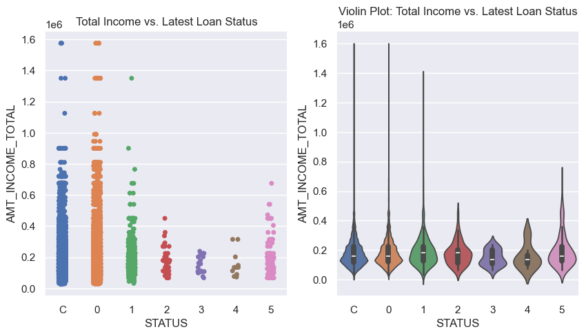
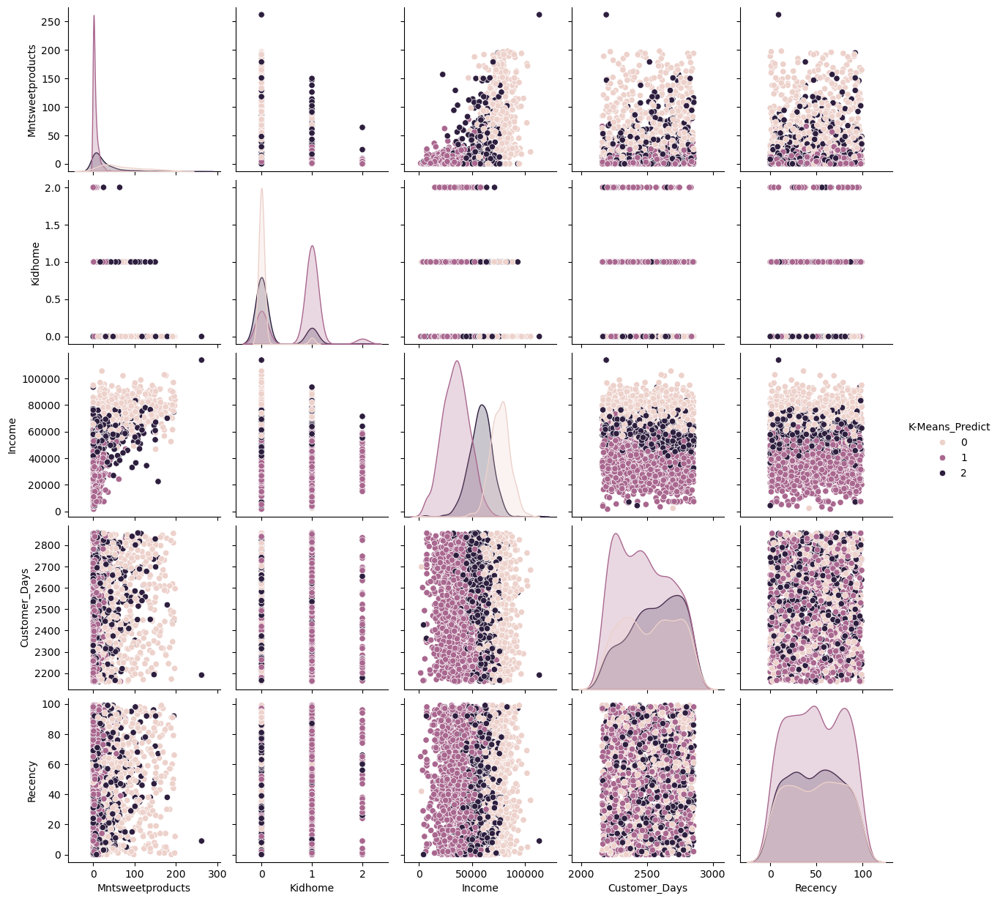
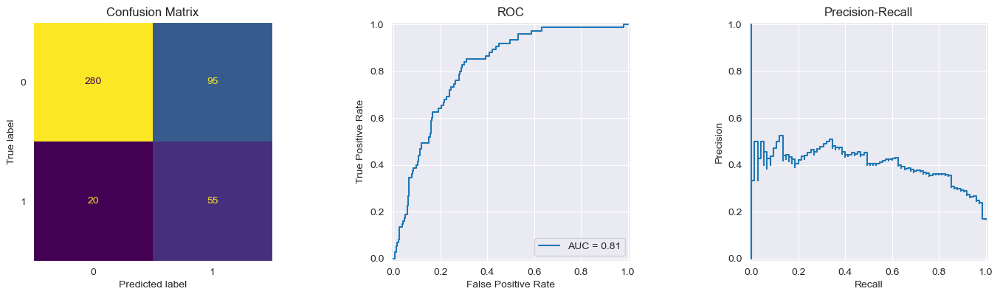
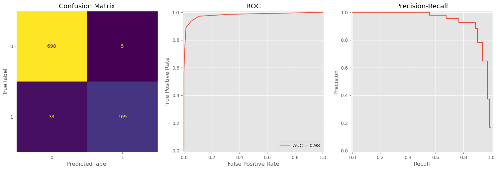
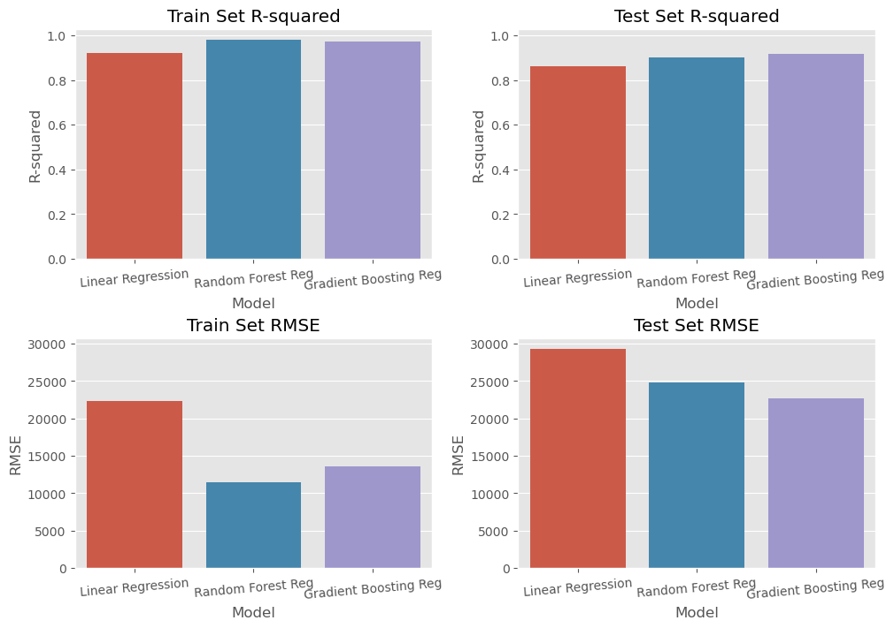
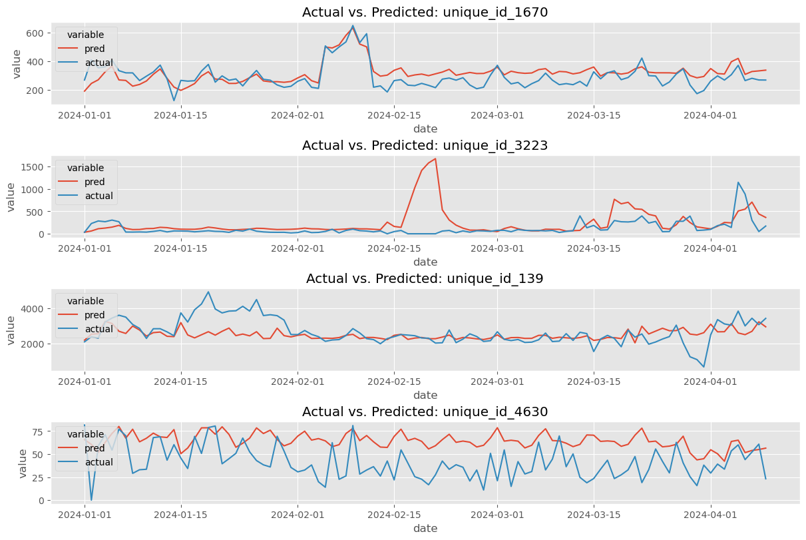

# PersonalProject_Python_Practice

This repo contains various mini-projects I completed as part of a Python training course.

It showcases various data analysis techniques we learned during the course:
- **Data Cleaning**: How to identify and handle data problems (missing values, incorrect formatting, outliers, duplicates...)
- **Exloratory Data Analysis**: How to summarize and visualize various data types and formats (categorical vs numerical, univariate vs multivariate)
- **Regression Models**: The basic motivation behind various regression models and how to apply then models (Linear Regression, Decision Tree/Random Forest Regressor, Gradient Boosting Regressor...)
- **Classification Models**: The basic motivation behind various classification techniques and how to apply the modles (Logistic Regression, Decision Tree/Random Forest Classifier...)

## Data
The data for **Time-Series_Retail-Sales-Prediction** notebook was provided by [Rohlik via Kaggle](Image/https://www.kaggle.com/competitions/rohlik-sales-forecasting-challenge/data).

The data for **EDA-Vintage-Analysis_Credit-Card-Data.ipynb** notebook was compiled by [Kaggle user rikdifos](Image/https://www.kaggle.com/datasets/rikdifos/credit-card-approval-prediction).

Data files are omitted from this repo in compliance with various sharing rules.

## EDA & Vintage Analysis

The goal of this exercise is to perform EDA and Vintage Analysis on a fictional Credit Card dataset to understand factors influencing credit card approval decisions and evaluate the performance of approved applications over time.

## Clustering

This notebook explores a dataset containing Customer data for a fictional e-Commerce company and attempts to group the Customers using Clustering techiniques. I first attempted both K-Means and DBSCAN and settled with the K-Means result due to DBSCAN not giving workable results with the given dataset.

Below is a pairplot to inspect differences between the predicted clusters.

## Logistic Regression

This exercise comes courtesy of SkillCate. The requirement is to build a model to evaluate risk of default for mortagages and determine a cut-off to maximize profit based on a (highly) simplified profit-loss model.

Below is the tuned model's performance on the test set:

## Random Forest Classifier

The goal of this exercise is to predict Churn for a fictional Telecommunication company.

Below is the model's performance on the test set:

## Regressors & Cross-sectional Data

The goal of this exercise is to forecast House Prices using the popular [House Prices dataset](Image/https://www.kaggle.com/competitions/house-prices-advanced-regression-techniques/data).
I trained and compared performance between a Linear Regression, Random Forest Regressor and Gradient Boosting Regressor model. It was interesting to note how the Random Forest regressor exhibit more overfit than the Gradient Boosting model.

Below is the comparison of R-Squared and RMSE for the 3 models on the train set and test set:

## Gradient Boosting & Time Series Data

This was by far the most difficult exercise as it not only tackled Time Series data but panel data in particular. This was team project with my course mate Chinh Khang, though I am only including my portion of the code here.

The goal was to predict **daily sales** for ~5000 SKU across 7 different warehouses using [sales data](Image/https://www.kaggle.com/competitions/rohlik-sales-forecasting-challenge/data) from **2020 to 2024** for an e-grocery provider named Rohlik.

As Time Series was not taught in the course, our team first naively tried to use the Gradient Boosting regressor from the **sklearn** library and made many mistakes in the the data set-up i.e. having a pre-calculated lag variable in the test set... This made the results basically unsuable. 

I then did additional research and tried to apply methods from the **skforecast** library instead. This again had mixed results due to us not being to shape the data in a way that meets the requirement from skforecast. And thus, we were only able to train models for ~1200 out of the ~5000 SKUs.

Regardless, it was an instructive process that taught me a lot about Time Series analysis and highlighted to me the importance of understanding and correctly setting up the initial problem.

Below is a sample of predictions from the **skforecast** attempt.

